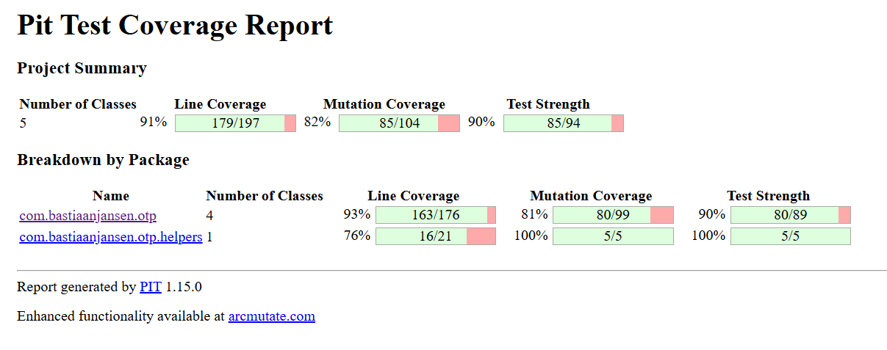
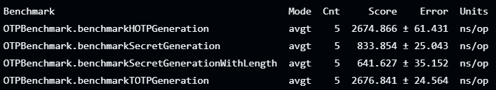
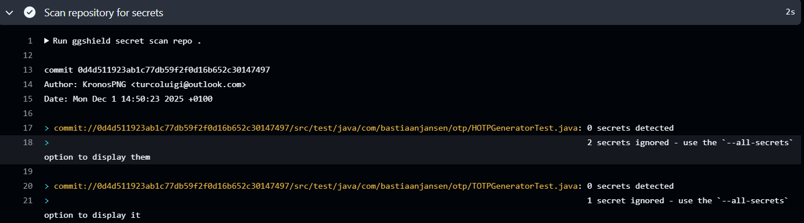

# Relazione sul Progetto OTP-Java: Implementazione di Tecniche di Dependability

## 1. Introduzione
Questo progetto implementa un generatore di password monouso (OTP) per Java secondo gli standard RFC 4226 (HOTP) e RFC 6238 (TOTP). Il progetto è stato arricchito con numerose tecniche di dependability per garantire qualità, affidabilità e sicurezza del software.

## 2. Build Automation e CI/CD

### 2.1 Build Locale e Maven
Il progetto è completamente buildabile sia localmente che in ambiente CI/CD attraverso Maven. Il file pom.xml configura tutte le dipendenze, i plugin e i profili necessari per la compilazione automatizzata.

### 2.2 Pipeline CI/CD
È stata implementata una pipeline completa di CI/CD utilizzando GitHub Actions (`.github/workflows/ci-cd.yml`) che include tre job principali:

#### Job 1: Build and Test
- **Build automatica** ad ogni push e pull request sui branch `main` e `dependability`
- **Esecuzione automatica** di test unitari, JaCoCo coverage e PITest mutation testing tramite `mvn clean verify`
- **Upload su Codecov** dei report di coverage
- **Gestione degli artifact** per i report JaCoCo e PIT

#### Job 2: Deploy
- **Deploy automatico su GitHub Pages** dell'applicazione web e dei report
- Deploy organizzato in:
  - `/app` - Applicazione web OTP
  - `/coverage` - Report JaCoCo
  - `/mutation` - Report PITest

#### Job 3: Docker
- **Build e push automatico** dell'immagine Docker
- Push su **Docker Hub** e **GitHub Container Registry**
- Utilizzo di cache per ottimizzare i build successivi

## 3. Testing

### 3.1 Test Suite Completa
Il progetto include un numero significativo di test case organizzati in:
- `HOTPGeneratorTest.java` - Test per la generazione HOTP
- `TOTPGeneratorTest.java` - Test per la generazione TOTP (oltre 20 metodi di test)
- `SecretGeneratorTest.java` - Test per la generazione di segreti
- `URIHelperTest.java` - Test per gli helper URI

### 3.2 Framework di Testing
Viene utilizzato **JUnit 5** come framework di testing, con l'aggiunta di **Hamcrest** per assertion più espressive.

## 4. Code Coverage con JaCoCo

### 4.1 Analisi della Copertura

Il progetto utilizza **JaCoCo** (Java Code Coverage) per analizzare la copertura del codice. I risultati mostrano:
- **Copertura complessiva delle istruzioni: 91%** (909/991 istruzioni coperte)
- **Copertura dei branch: 90%** (27/30 branch coperti)
- **Copertura delle linee: 93%** (179/193 linee coperte)
- **Copertura dei metodi: 89%** (58/65 metodi coperti)

### 4.2 Dettaglio per Package
- Package `com.bastiaanjansen.otp`: 91% di copertura delle istruzioni
- Package `com.bastiaanjansen.otp.helpers`: 90% di copertura delle istruzioni

### 4.3 Reporting
I report JaCoCo vengono generati automaticamente in formato HTML e XML (`target/site/jacoco/jacoco.xml`) durante la fase di test. La pipeline CI/CD:
- Carica i report su **Codecov** per tracking della copertura nel tempo
- Salva gli artifact JaCoCo per consultazione
- Deploya i report su **GitHub Pages** per visualizzazione pubblica

## 5. Mutation Testing con PIT

### 5.1 Campagna di Mutation Testing
Il progetto implementa una campagna completa di mutation testing utilizzando **PITest** per valutare l'efficacia della test suite.

I risultati ottenuti mostrano:
- **Mutation Coverage: 82%**
- **Test Strength: 90%**
- **Line Coverage per mutation testing: 91%**

### 5.2 Configurazione
Il mutation testing viene eseguito automaticamente durante la fase di verifica (`mvn verify`) nella pipeline CI/CD. Il `pom.xml` configura PITest con:
- **Mutation Threshold**: 70% (soglia minima per mutation coverage)
- **Coverage Threshold**: 80% (soglia minima per line coverage)
- **Mutatori**: DEFAULTS (set standard di mutazioni)
- **Esclusioni**: Benchmark, codice generato JMH, e server code

## 6. Performance Testing con JMH

### 6.1 Microbenchmarking
Il progetto include **JMH (Java Microbenchmark Harness)** per testare le performance dei componenti più critici:
- File di benchmark: OTPBenchmark.java
- Dipendenze JMH core e annotation processor configurate
- Esclusione delle classi generate da JMH dalla copertura e dal mutation testing

### 6.2 Esecuzione
I benchmark possono essere eseguiti tramite maven.

Il metodo utilizzato è un approccio con 3 iterazioni di warmup e 5 iterazioni di misurazione, con un fork per isolamento.
I Benchmark utilizzano come metrica il tempo medio in nanosecondi per operazione.

### 6.3 Risultati
I risultati dei benchmark mostrano le performance delle operazioni di generazione OTP e altre funzioni critiche.

Come si può vedere, le operazioni di generazione dei secret sono estremamente veloci, con tempi medi nell'ordine di poche centinaia di nanosecondi per le operazioni più semplici.

Mentre operazioni più complesse, come la generazione di OTP, richiedono tempi leggermente superiori ma rimangono comunque nell'ordine dei microsecondi, non arrivando a superare i 3 microsecondi per operazione.

## 7. Analisi della Sicurezza

### 7.1 Strumenti di Security Analysis
Il progetto implementa tre diversi meccanismi di analisi della sicurezza:

#### 7.1.1 Snyk
- Workflow GitHub Actions dedicato (snyk-security.yml)
- Analisi automatica delle dipendenze Maven
- Soglia di severità configurata su "high"

Il test con Snyk iniziale ha rilevato alcune vulnerabilità nelle dipendenze, che sono state prontamente aggiornate alle versioni più sicure per mitigare i rischi. Le successive scansioni non hanno rilevato nuove vulnerabilità, garantendo la sicurezza del progetto.

#### 7.1.2 GitGuardian
- Workflow per la scansione dei segreti (gitguardian.yml)
- Utilizzo di `ggshield` per identificare credenziali o chiavi esposte nel repository

GitGuardian ha segnalato inizlamente un false positive sulla viriable `secret` che si riferisce al secret utilizzato nella generazione OTP. Non sono stati rilevati altri segreti esposti nel codice.

#### 7.1.3 SonarQube/SonarCloud
- Workflow dedicato (sonarqube.yml)
- Analisi statica del codice per vulnerabilità e code smells
- Test coverage bypassati per evitare duplicazioni con JaCoCo e PITest

In questo caso SonarQube ha rilevato una grande quantità di code smells e alcune vulnerabilità iniziali. Tuttavia, la maggior parte di questi problemi risultavano essere False Positives o problemi minori. Le vulnerabilità reali sono state risolte aggiornando le dipendenze e migliorando il codice.

Tra gli esempi di False Positives vi sono:
- Multiple righe di commento che SonarQube interpreta come potenziali problemi, ma che in realtà sono annotazioni JML.
- Utilizzo di label HTML che non hanno una propertà `for`, ma che non sono rilevanti per la sicurezza o la funzionalità del codice.
- Metodi costruttori vuoti che SonarQube segnala come potenziali problemi, ma che non rappresentano un rischio effettivo.
- Lambda expressions che SonarQube interpreta come potenziali problemi di generazione di eccezioni, ma che sono sicure nel contesto del codice.

### 7.2 Risultati
L'applicazione web non presenta vulnerabilità effettive dopo le correzioni apportate. Le analisi di sicurezza sono integrate nella pipeline CI/CD per garantire la sicurezza continua del progetto.

## 8. Containerizzazione e Orchestrazione

### 8.1 Dockerfile Multi-Stage
È stato implementato un Dockerfile multi-stage che:
- Utilizza Maven per il build in una fase separata
- Crea un'immagine runtime leggera basata su Alpine Linux
- Include health check per il monitoraggio dello stato dell'applicazione
- Espone la porta 7000 per il server web

### 8.2 Docker Compose
Il file docker-compose.yml configura:
- Servizio `otp-server` con configurazione delle risorse Java
- Health check automatici
- Restart policy per la resilienza
- Port mapping per l'accesso esterno

### 8.3 Deployment
L'immagine Docker è disponibile su DockerHub e pronta per essere orchestrata in ambienti di produzione.

## 9. Applicazione Web

Il progetto include un'applicazione web completa (public) implementata con:
- **Backend**: Server Javalin (lightweight web framework)
- **API REST** per generazione e verifica OTP (documentata in SERVER_API.md)
- **Frontend**: Interfaccia web con HTML, CSS e JavaScript
- **Funzionalità**:
  - Generazione di segreti
  - Generazione e verifica di codici TOTP/HOTP
  - Generazione di URI per app di autenticazione
  - Timer live per codici TOTP

## 10. Specifica Formale (Tentativo con OpenJML)

### 10.1 Configurazione
Il progetto include un profilo Maven (`openjml-check`) configurato per eseguire verifiche formali sui metodi core attraverso OpenJML, organizzato a layer:
- **Layer 1**: Metodi foglia (es. `HMACAlgorithm.getHMACName()`, `SecretGenerator.generate()`)
- **Layer successivi**: Metodi che dipendono dai precedenti

### 10.2 Limitazioni Riscontrate
Nonostante la configurazione sia presente nel pom.xml, la verifica formale tramite OpenJML non è stata completata con successo a causa di:
- Problemi di compatibilità con l'ambiente di sviluppo
- Complessità nell'integrazione di OpenJML con Maven
- Difficoltà tecniche nell'esecuzione tramite WSL

### 10.3 Approccio Alternativo
In assenza di verifica formale JML, il progetto compensa con:
- Test coverage molto elevat
- Test strength alto nel mutation testing
- Analisi statica multipla (SonarQube)

## 11 Esclusioni da Analisi
Il pom.xml configura opportune esclusioni da Sonar per:
- Codice di benchmark
- Codice server
- Risorse statiche
- Test (analizzati separatamente)

## 12. Conclusioni e Checklist

✅ **Build e CI/CD**: Sistema completamente automatizzato

✅ **Testing**: Suite completa con coverage del 91%

✅ **Code Coverage**: Analisi approfondita con JaCoCo

✅ **Mutation Testing**: Validazione dell'efficacia dei test con PITest (82% mutation coverage, 90% test strength)

✅ **Performance Testing**: Microbenchmark con JMH

✅ **Security**: Analisi multi-tool (Snyk, GitGuardian, SonarQube)

✅ **Containerizzazione**: Docker multi-stage e orchestrazione con Docker Compose

✅ **Applicazione Web**: Interfaccia utente completa con API REST

⚠️ **Verifica Formale**: Configurata ma non completata a causa di limitazioni tecniche di OpenJML

Il progetto rappresenta un esempio completo di applicazione delle tecniche di dependability, con particolare eccellenza nelle aree di testing automatizzato, continuous integration, e analisi della sicurezza. L'unica area non completata (verifica formale con OpenJML) è ampiamente compensata dall'elevata copertura dei test e dalle analisi statiche multiple.
